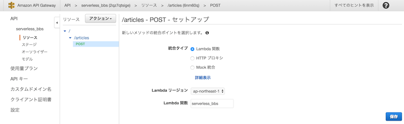
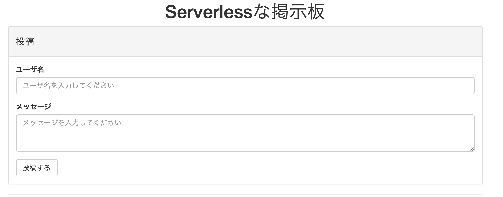

# サーバレスでWebアプリを作ろう

JAWSUG青森 (石澤・福井)

2016/09/15

---

## 自己紹介
- - -

---


## 自己紹介
- - -

- 石澤 直人 (Naoto Ishizawa)
- Engineer @ Heptagon inc. (since 2013. 11 ~)
- Born in 弘前. Living in 仙台.
- http://blog.youyo.info/

---

## 自己紹介
- - -

- 福井 烈 (Takeshi Fukui)
- Engineer @ Piece of Cake, inc. (since 2015. 3 ~)
  - cakes (https://cakes.mu)
  - note (https://note.mu)
- Born in 弘前. Living in 大鰐町.
- リモートワーカー
- 1児の父
- http://fukuiretu.com

---

## アジェンダ
- - -

1. ハンズオン概要
1. 今回利用するAWSのサービス概要
1. 題材ダウンロード
1. Dynamo DBの設定
1. Lambdaの設定
1. API Gatewayの設定
1. Webアプリから接続
1. 演習問題

---

## ハンズオン概要
- - -

API Gateway + Lambda + DynamoDBで  
Serverlessな掲示板を作ろう

(ついでにReact.jsも使っちゃおう)

---


## DEMO

---


## Serverlessって？
- - -

- API-Gateway + Lambdaのようなファンクション単位でのコード実行環境が整った
- 実行されるコードに状態を保存しておけないので、フルマネージドのデータストアを利用
- フルマネージドサービスを使ったサーバ構築/管理が不要なアーキテクチャが出来上がった

-  **Serverless Architecture**

---

## 題材ダウンロード
- - -

以下のURLよりダウンロードし、

zipファイルを解凍してください

https://github.com/jaws-ug-tohoku/hands-on_serverless_bbs/archive/master.zip  

https://goo.gl/5Ok2Fs (Githubページへの短縮URL)

<br/>

gitを利用している方は以下のコマンドでも可能です

```
$ git clone https://github.com/jaws-ug-tohoku/hands-on_serverless_bbs.git
```

---

## Dynamo DBの設定
- - -

---

## Dynamo DBとは
- - -

- AWSが提供するNoSQLのフルマネージドサービス
- スキーマレスなので事前のスキーマ設定が不要
- データベース容量は使用量に応じて自動的に拡張
- 秒間あたりのread/writeスループットを設定可能

---

## Dynamo DBを選択する
- - -


---

## テーブルを作成する
- - -


---

## テーブルを作成する
- - -
テーブル名、パーティションキーを設定し作成  
テーブル名は他の人と被らないようにユニークなものを設定


---

## AWS Lambdaの設定
- - -

---

## AWS Lambdaとは
- - -

- サーバーのプロビジョニングや管理なしでコードを実行できる
- コードの実行時間に対して料金が発生
- リクエスト数に応じて自動でスケール
- DynamoDBやAPI-Gatewayなど別のサービスと連携し、特定のイベントをトリガーとして実行可能

---

## AWS Lambdaの設定
- - -


---

## AWS Lambdaの設定
- - -


---

## 雛形をskip
- - -


---

## Lambda実行のトリガー設定
- - -


---

## AWS Lambdaの設定
- - -

`Name` を入力し、 `Runtime` で `python2.7` を選択する


---

## AWS Lambdaの設定
- - -

`lambda_function/lambda_function.py` ファイルの中身を一部変更しつつコピペする


---

## AWS Lambdaの設定
- - -

`table_name` を自分で作成したDyanmoDBのテーブル名に変更

```
# -*- coding: utf-8 -*-

table_name = 'serverless_bbs'

import uuid
import boto3
.
.
.
```

---

## AWS Lambdaの設定
- - -

`create a custom role` を選択し、IAMロールを作成する


---

## IAMロールとは
- - -

- AWSへのアクセスを安全に制御するための仕組み
- IAMユーザーとIAMロールがある
- 誰がAWS リソースを使用できるか（認証）
- どのリソースをどのような方法で使用できるか（承認）

---

## IAMロールの設定
- - -

`lambda_basic_execution_with_dynamodb` というロール名を入力、ポリシードキュメントに `policy.txt` ファイルの内容をコピペする


---

## IAMロールの設定
- - -

`lambda_basic_execution_with_dynamodb` というロール名を入力、ポリシードキュメントに `policy.txt` ファイルの内容をコピペする

```
{
  "Version": "2012-10-17",
  "Statement": [
    {
      "Sid": "Stmt1473745720000",
      "Effect": "Allow",
      "Action": [
        "dynamodb:BatchGetItem",
        "dynamodb:BatchWriteItem",
        "dynamodb:DeleteItem",
        "dynamodb:DescribeStream",
        "dynamodb:GetItem",
        "dynamodb:GetRecords",
        "dynamodb:GetShardIterator",
        "dynamodb:ListStreams",
        "dynamodb:PutItem",
        "dynamodb:Query",
        "dynamodb:Scan",
        "dynamodb:UpdateItem"
      ],
      "Resource": [
        "arn:aws:dynamodb:ap-northeast-1:*:table/*"
      ]
    },
    {
      "Effect": "Allow",
      "Action": [
        "logs:CreateLogGroup",
        "logs:CreateLogStream",
        "logs:PutLogEvents"
      ],
      "Resource": "arn:aws:logs:*:*:*"
    }
  ]
}
```

---

## AWS Lambdaの設定
- - -

`Timeout` の値を10secにする


---

## 確認画面
- - -


---

## API Gatewayの設定
- - -

---

## API Gatewayとは
- - -

- AWS Lambdaや別のAWSのサービスに対してREST-APIのインターフェイスを提供
- 別のWebアプリケーションへのHTTP-Proxy機能
- 認証機能

---

## API Gatewayの設定
- - -


---

## 新しいAPIの作成
- - -

API名はユニークなものを設定


---

## リソースの作成
- - -


---

## リソースの作成
- - -
リソース名/リソースパスに'articles'と入力する


---

## メソッドの作成
- - -


---

## メソッドの作成
- - -


---

## メソッドの作成
- - -



---

## メソッドの設定
- - -


---

## メソッドの設定
- - -


---

## メソッドの設定
- - -

```
{
  "httpMethod": "$context.httpMethod",
  "username": $input.json('username'),
  "message": $input.json('message')
}
```

---

## メソッドの設定
- - -


---

## メソッドの設定
- - -


---

## メソッドの設定
- - -

```
$util.parseJson($input.json('$'))
```

---

## メソッドの作成
- - -

同様の手順でGETメソッドも実装する  
統合リクエストのマッピングテンプレートは下記のように設定する  
統合レスポンスはPOSTと同様に設定

```
{
  "httpMethod": "$context.httpMethod"
}
```

---

## CORSの設定
- - -


---

## APIのデプロイ
- - -


---

## APIのデプロイ
- - -

表示されるURLをメモしておく  
(末尾の `/bbs` は不要)


---

## WebアプリからAPIへ接続

---


## ちょっとだけReact.jsの説明

---


## React.jsとは
- - -
- UIのパーツ(コンポーネント)を作るViewのためのライブラリ
- Facebook謹製のOSS (https://github.com/facebook/react)
- もちろんFacebook自身もReact.js製
- ちなみにcakesとnoteは...
  - cakes -> jQuery
  - note -> AngularJS(1系)

---


## React.jsのメリット/デメリット
- - -

メリット

- パフォーマンスが良い (仮想DOMという仕組み)
  - リアルなDOMはなぜ遅いのか (http://steps.dodgson.org/b/2014/12/11/why-is-real-dom-slow/)
- ある程度のルールを強制されるので、メンテナンス性も期待できる


デメリット

- 学習コスト
- jQueryをベースにしたライブラリとは相性が悪いので、エコシステムが生かせない可能性がある

---

## React.jsのコンポーネント実装例
- - -

```
var PostForm = React.createClass({
  render: function() {
    return (
      <div className="panel panel-default">
        <div className="panel-heading">
          <h4>投稿</h4>
        </div>
        <div className="panel-body">
          <form onSubmit={this.props.handleSubmit}>
            <div className="form-group">
              <label htmlfor="userName">ユーザ名</label>
              <input type="text" name="userName" value={this.props.userName}
                onChange={this.props.changeUserName}
                className="form-control"
                placeholder="ユーザ名を入力してください" />
            </div>
            <div className="form-group">
              <label htmlfor="message">メッセージ</label>
              <textarea name="message" className="form-control" rows="3"
                onChange={this.props.changeMessage} placeholder="メッセージを入力してください">
                {this.props.message}
              </textarea>
            </div>
            <button type="submit" className="btn btn-default">投稿する</button>
          </form>
        </div>
      </div>
    );
  }
});
```
---


## React.jsのコンポーネント実装例
- - -


---


## WebアプリからAPIへ接続(1/3)
- - -

web/bbs.htmlをお使いのエディタ(vim, Atom, サクラエディタ etc)で開き、

以下の定数(const)をAPI Gatewayで設定したエンドポイントに書き換える

```
// 80行目辺り
// TODO: 各々の環境に合わせて変更する
const ENDPOINT = "https://xxxxxxxxxx.execute-api.ap-northeast-1.amazonaws.com";
```

---


## WebアプリからAPIへ接続(2/3)
- - -

web/bbs.htmlをお好みのWebブラウザ(Google Chrome, Internet Exproler etc)で開く



---

## WebアプリからAPIへ接続(3/3)
- - -

ユーザ名、メッセージを入力して投稿してみましょう


---


## 演習問題
- - -

1. 投稿項目に「タイトル」を追加してください
2. 投稿内容の「削除機能」を追加してください

---


# FIN
